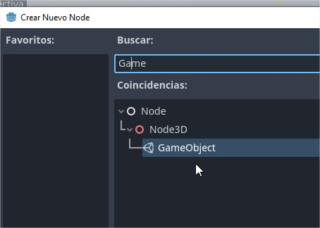
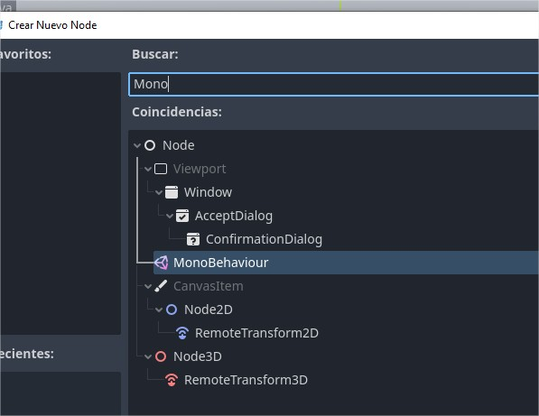

# UnityToGodotHelper
This project is a basis to ease the porting of code developed in Unity to Godot.

Place the addons directory directly into your godot project folder.

Enable the plugins from Project Settings / Plugins
- GameObject
- MonoBehaviour

Add GameObjects to your Godot scene, and add MonoBehaviours to your GameObjects.

Copy your Unity scripts for classes derived from MonoBehaviour into your Godot project and amend them to make them work inside Godot.
[SceneTree](imgs/SceneTree.jpg)