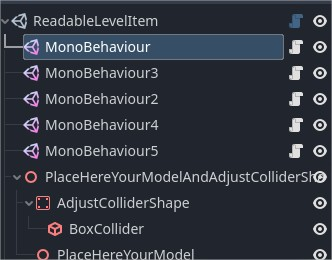

# UnityToGodotHelper
This project is a basis to ease the porting of code developed in Unity to Godot.

Place the addons directory directly into your godot project folder.

Enable the plugins from Project Settings / Plugins
- GameObject
- MonoBehaviour

Add GameObjects to your Godot scene, and add MonoBehaviours to your GameObjects.

Copy your Unity scripts for classes derived from MonoBehaviour into your Godot project and amend them to make them work inside Godot.

Once they build properly, you can set them as the script of a MonoBehaviour node attached to a GameObject in the scene tree. This way we can mimic the component composition in GameObjects like Unity does.

## TODO
Automatically set the node name in the scene tree, to the name of the script attached to the MonoBehaviour node.
